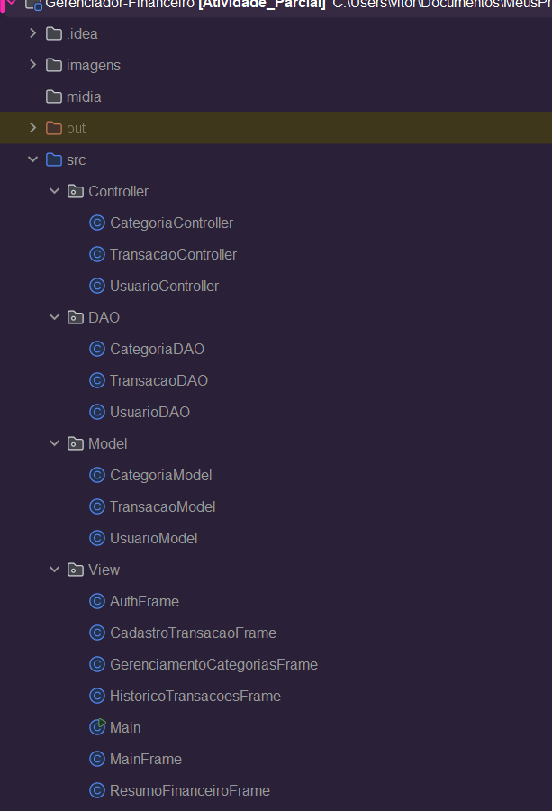

# 💰 Sistema de Gestão Financeira Pessoal 
  Aplicação desenvolvida em Java com Swing para auxiliar usuários no gerenciamento de suas finanças pessoais, permitindo o cadastro de receitas e despesas, categorização, autenticação de usuários e visualização de um resumo financeiro.

## 📌 Objetivo
  Este projeto foi desenvolvido como parte da disciplina Laboratório de Programação Orientada a Objetos (2025/1) com o objetivo de aplicar os conceitos de POO em uma aplicação gráfica funcional, intuitiva e útil para o dia a dia.

## ⚙️ Funcionalidades
* Cadastro de Transações (Receitas e Despesas)
* Consulta de Histórico de Transações com filtros
* Resumo Financeiro com saldo, total de receitas e despesas
* Gerenciamento de Categorias (criar, editar, excluir)
* Cadastro e Autenticação de Usuário com dados armazenados em memória

## 🛠️ Tecnologias Utilizadas
* ☕ Java
* 🖼️ Swing (para interface gráfica)
* 🧠 Estruturas de dados em memória (sem banco de dados externo)

## 💻 Como Executar
* Requisitos: JDK instalado

## 📂 Estrutura do Projeto
### 🔄 Padrão de Arquitetura MVC:
  O projeto foi estruturado seguindo o padrão Model-View-Controller (MVC), que separa as responsabilidades da aplicação em três camadas 
  * Model (dados e regras de negócio)
  * View (interface com o usuário)
  * Controller (lógica de controle e comunicação entre as camadas) — facilitando a organização, manutenção e escalabilidade do código.

  

